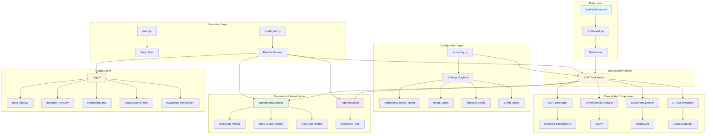

# Topic Modeling System Architecture

## Architecture Diagram

```mermaid
graph TB
    subgraph "Data Layer"
        A[data/raw/data.json] --> B[src/data/etl.py]
        B --> C[DataFrame]
    end
    
    subgraph "Configuration Layer"
        D[src/config.py] --> E[Settings Singleton]
        E --> F[embedding_model_config]
        E --> G[umap_config]
        E --> H[hdbscan_config]
        E --> I[c_tfidf_config]
    end
    
    subgraph "Core Model Components"
        J[BERTEmbedder] --> K[sentence-transformers]
        L[DimensionalityReducer] --> M[UMAP]
        N[DocumentClusterer] --> O[HDBSCAN]
        P[CTFIDFVectorizer] --> Q[CountVectorizer]
    end
    
    subgraph "Main Model Pipeline"
        R[BERTTopicModel] --> J
        R --> L
        R --> N
        R --> P
    end
    
    subgraph "Evaluation & Visualization"
        S[TopicModelEvaluator] --> T[Clustering Metrics]
        S --> U[Topic Quality Metrics]
        S --> V[Coverage Metrics]
        W[TopicVisualizer] --> X[Interactive Plots]
    end
    
    subgraph "Execution Layer"
        Y[main.py] --> Z[Entry Point]
        AA[model_run.py] --> AB[Pipeline Runner]
        AB --> R
        AB --> S
        AB --> W
    end
    
    subgraph "Output Layer"
        AC[output/] --> AD[topic_info.csv]
        AC --> AE[document_info.csv]
        AC --> AF[embeddings.npy]
        AC --> AG[visualizations/*.html]
        AC --> AH[evaluation_metrics.json]
    end
    
    C --> R
    D --> R
    R --> S
    R --> W
    AB --> AC
    
    style A fill:#e1f5ff
    style R fill:#fff4e1
    style S fill:#e8f5e9
    style W fill:#f3e5f5
    style AC fill:#fff3e0
```

